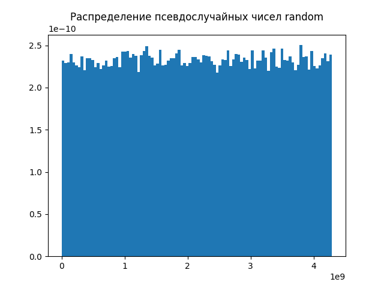
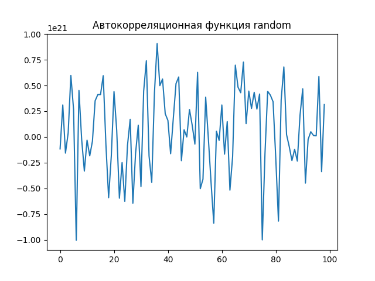

# ModSysLab2
[Ссылка на код](./index.py)

#### Длина периода
Я использовал словарь для отслеживания уже встреченных значений, и как только появляется повтор — цикл завершает выполнение, а длина периода считается количеством шагов.
  
При подобранных коэффициентах длинна периода моего генератора стремится к `m` и равна примерно 2 миллиардам, для `random()` ещё выше, ввиду ещё большего значения `m`, и измерить не удалось из-за переполнения оперативной памяти.

#### Равномерность распределения
Для проверки равномерности использовал гистограмму, отображающую частоту появления чисел в диапазоне.  
В коде сгенерировал 100 000 чисел и использовал библиотеку matplotlib для построения гистограммы.

  
  

#### Независимость
Для проверки независимости между сгенерированными числами я предложил вычислять автокорреляцию. Если автокорреляция близка к нулю на разных отклонениях между соседними элементами последовательности, это свидетельствует о независимости.  
В коде использовал библиотеку numpy, чтобы вычислить корреляцию между последовательными элементами числового ряда.

  
  

#### Скорость генерации
Для этого я использовал модуль time для измерения времени выполнения функции генерации 1000000 чисел и делил на количество потраченных секунд.  
  
Скорость генерации: 4181596.1293628663 чисел в секунду для lcg  
Скорость генерации: 21397217.645048235 чисел в секунду для random
